# Introduction to Backend Engineering

What Is a Backend, How It works and Why Does It Matter?

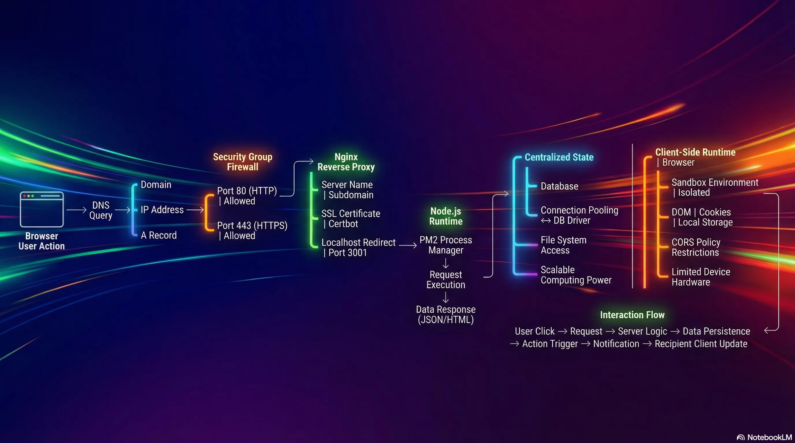

<div style="position:relative;width:100%;padding-bottom:56.25%;height:0;">
  <iframe
    src="https://www.youtube.com/embed/JF-ZV1TjO-M?si=LJdlA6sbQEVHd2E2"
    title="YouTube video player"
    style="position:absolute;top:0;left:0;width:100%;height:100%;border:0;"
    allow="accelerometer; autoplay; clipboard-write; encrypted-media; gyroscope; picture-in-picture; web-share"
    referrerpolicy="strict-origin-when-cross-origin"
    allowfullscreen>
  </iframe>
</div>

## 1. Definition of a Backend

### 1.1. Traditional Definition

A backend is a computer that listens for requests through an open port (accessible over the internet) to allow clients or frontends to connect, send data, or receive data.

*   **Communication Protocols:** HTTP, WebSocket, gRPC.
*   **Common Ports:** 
    *   **80:** Standard HTTP.
    *   **443:** Secure HTTPS.
*   **Role:** It is called a "Server" because it provides or "serves" content.
*   **Content Types Served:**
    *   Static files (Images, JavaScript, HTML).
    *   Data formats (JSON).
*   **Data Ingestion:** It accepts data sent by the client.

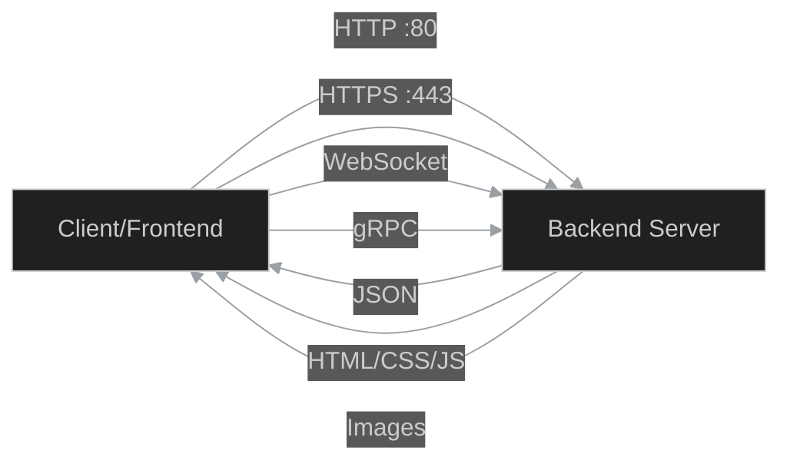

---

## 2. End-to-End Request Flow (Backend Demo)

This trace follows a request starting from a browser and reaching a backend server deployed on AWS.

### 2.1. Step 1: The Browser & Domain Name

*   **Action:** A request is initiated by entering a domain name in the browser (e.g., `backend-demo.senus.doxyz`).
*   **Initial Lookup:** The browser must resolve this domain name to an IP address to know where to connect.

### 2.2. Step 2: DNS Server (Domain Name System)

The DNS server translates domain names into IP addresses. It contains specific record types:

*   **A Records:** Used to point a domain or subdomain to a specific **IP Address**.
    *   *Example:* The subdomain `backend-demo` points to a specific Public IP address of an AWS EC2 instance.
*   **CNAME Records:** Used to point a domain or subdomain to another **domain name**.

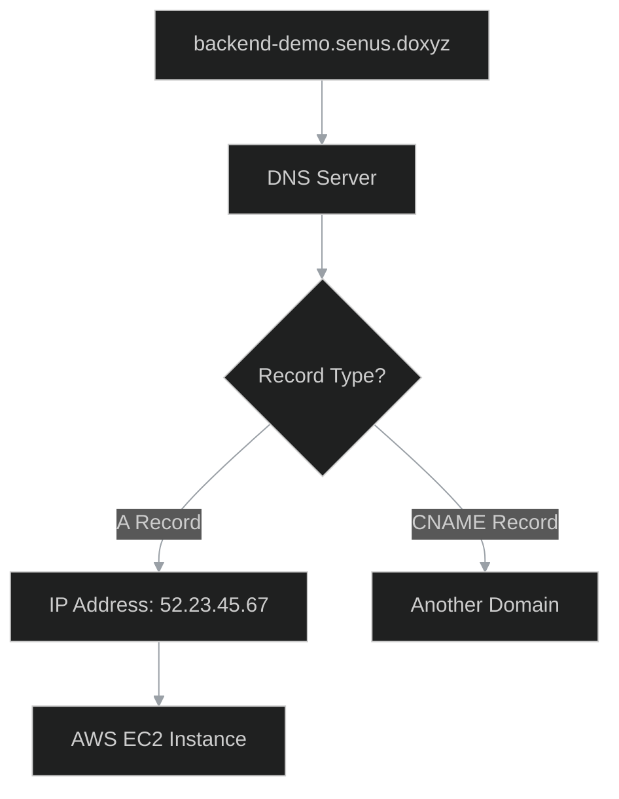

### 2.3. Step 3: Cloud Infrastructure (AWS EC2)

*   **Destination:** The IP address obtained from the A Record belongs to an **EC2 instance** (a virtual server) located in a specific AWS subnet.
*   **Public IP:** The request travels through the internet to reach this specific Public IP address.

### 2.4. Step 4: The Firewall (AWS Security Groups)

Before the request enters the actual computer (instance), it passes through a cloud-native firewall.

*   **Function:** Filters traffic based on allowed ports.
*   **AWS Security Groups:** define which ports are accessible over the internet.
*   **Configuration in Demo:**
    *   **Port 22:** Allowed for SSH access (logging into terminals/command prompts).
    *   **Port 443:** Allowed for HTTPS traffic.
    *   **Port 80:** Allowed for HTTP traffic.
*   **Warning:** If ports 80 or 443 are not explicitly allowed in the Security Group, AWS blocks the request immediately. It will never reach the server.

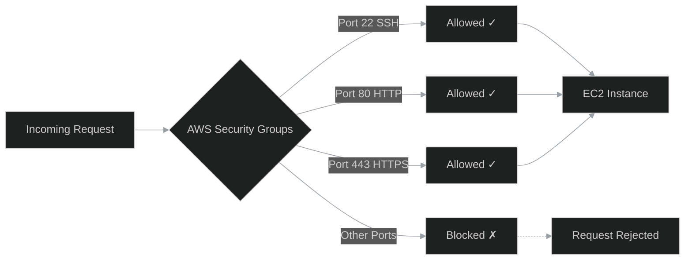

### 2.5. Step 5: Reverse Proxy (Nginx)

Once the request passes the firewall and enters the instance, it hits a **Reverse Proxy**.

*   **Definition:** A server sitting in front of other servers to manage redirects, configurations, and SSL from a centralized place (rather than configuring every application server individually).
*   **Tool Used:** **Nginx**.
*   **SSL Management:** **Certbot** is used to assign SSL certificates automatically.
*   **Nginx Configuration Logic:**
    1.  **Listen:** Listens for requests on Port 80.
    2.  **Redirect:** Redirects Port 80 requests to Port 443 (HTTPS).
    3.  **Server Name:** Checks the domain name (e.g., `backend-demo`).
    4.  **Proxy Pass:** Forwards traffic matching that domain to the local application server running on a specific internal port.
    *   *Example Code Logic:*
        ```nginx
        server_name backend-demo.senus.doxyz;
        location / {
            proxy_pass http://localhost:3001;
        }
        ```

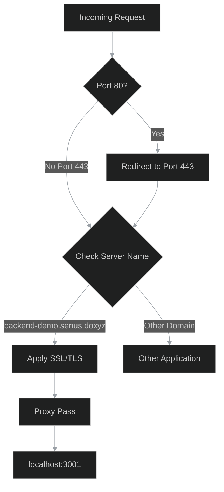

### 2.6. Step 6: The Application Server (Node.js)

*   **Final Destination:** Nginx forwards the request to **localhost:3001**.
*   **Process Management:** **PM2** is used to manage the Node processes.
    *   *Example:* `pm2 list` shows processes for frontend and backend.
*   **Execution:** The Node server processes the request and returns the response (e.g., JSON data).
*   **Localhost Parity:** From the perspective of the EC2 instance, the server is running on `localhost`.
    *   *Note:* Running `curl localhost:3001/users` inside the instance returns the same response as accessing the public domain from the browser.

### 2.7. Summary of the Flow

1.  **Browser:** Initiates request.
2.  **DNS:** Resolves domain to AWS Public IP.
3.  **AWS Firewall:** Allows traffic on Port 443/80.
4.  **Instance:** Receives request.
5.  **Nginx (Reverse Proxy):** Receives request, handles SSL, identifies domain, forwards to internal port.
6.  **Node Server:** Receives request on `localhost:3001`, processes it, returns response.

```mermaid
%%{init: {"theme": "dark", "themeVariables": {"primaryColor": "#2d2d2d", "primaryTextColor": "#e6edf3", "primaryBorderColor": "#444444", "lineColor": "#9aa0a6", "secondaryColor": "#3a3a3a", "tertiaryColor": "#2d2d2d"}}}%%
flowchart LR
    Browser[Browser] -->|Domain Name| DNS[DNS Server]
    DNS -->|Public IP| Firewall[AWS Security Groups]
    Firewall -->|Port 443/80| Instance[EC2 Instance]
    Instance --> Nginx[Nginx Reverse Proxy]
    Nginx -->|SSL, Domain Check| Node[Node.js Server :3001]
    Node -->|Response| Nginx
    Nginx --> Instance
    Instance --> Firewall
    Firewall --> DNS
    DNS --> Browser
```

---

## 3. The Purpose of Backend Systems

Why are backends necessary?

### 3.1. The Core Concept: Centralized Data

If you strip down the responsibility of a backend to a single word, it is **Data**.

*   The need to **fetch** data.
*   The need to **receive** data.
*   The need to **persist** (save) data.

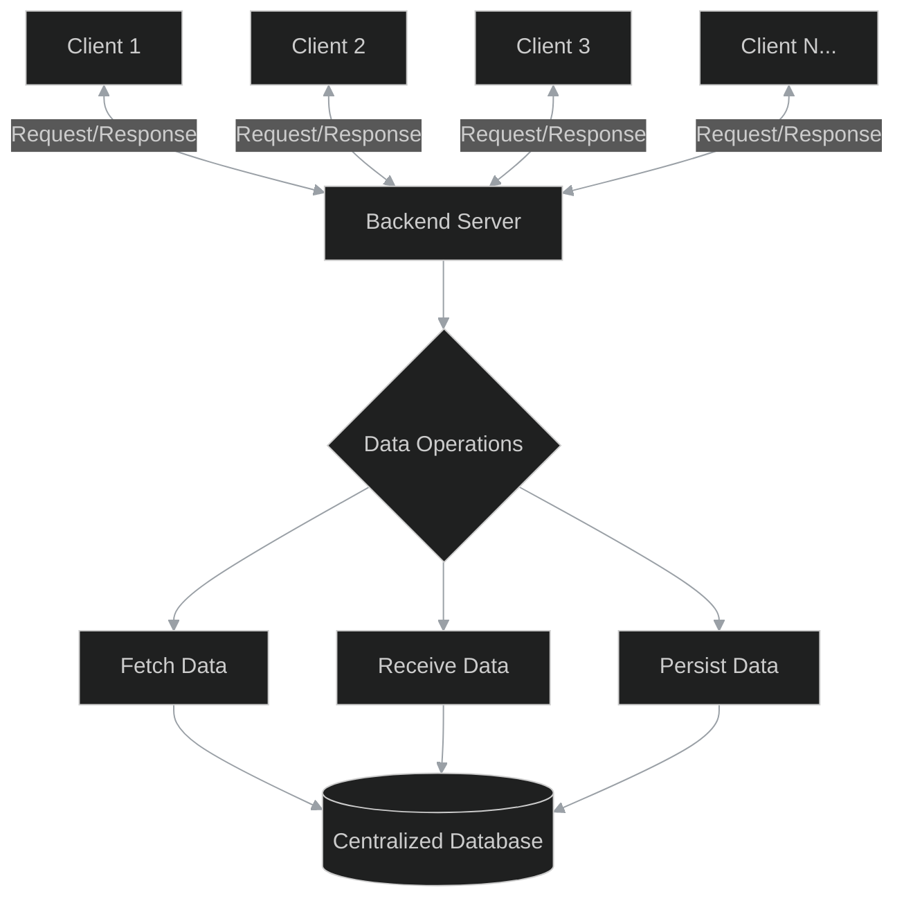

### 3.2. Example: The "Like" Button Flow

Imagine a user liking a friend's post on Instagram:

1.  **User Action:** User clicks the "Like" button.
2.  **Request:** The app sends a request to the server.
3.  **Identification:** The server parses the request to identify the user (ID/Name).
4.  **Persistence:** The server **saves** the action (the "like") to a database.
5.  **Logic:** The server identifies the owner of the post.
6.  **Notification:** The server triggers an action to send a notification to the post owner's phone.

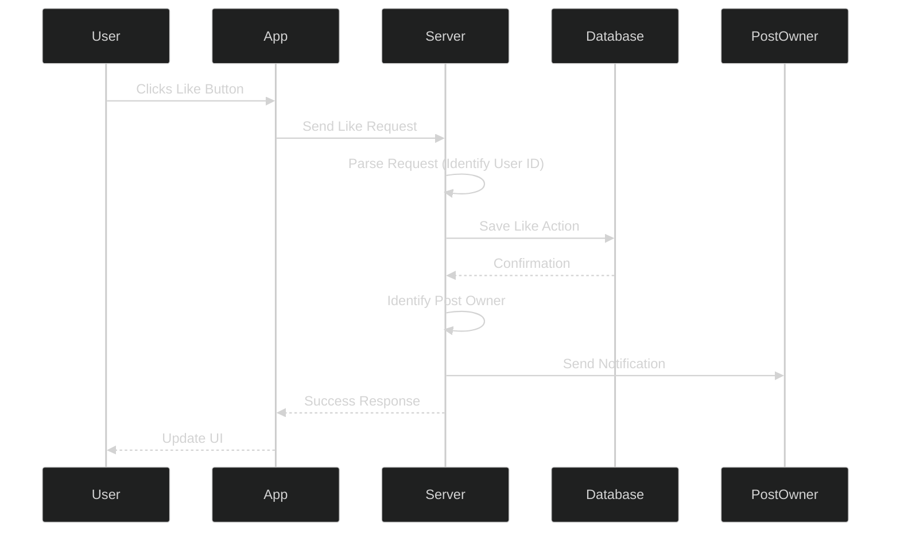

### 3.3. Why this requires a Backend

*   **Centralization:** The server must hold information about *all* users and *all* states.
*   **Client Limitation:** A user's app/frontend only contains data relevant to that specific user (their profile, their feed). It does not possess the global state required to route notifications to other users.
*   **State Management:** Interactions between different users require a centralized computer to mediate and persist these changes.

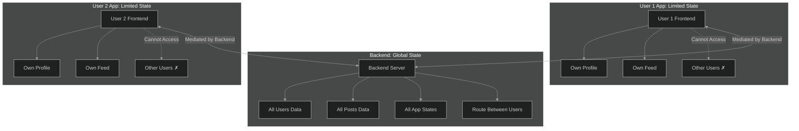

---

## 4. Frontend Architecture vs. Backend Architecture

To understand why backend logic cannot live in the frontend, we must look at how the frontend works end-to-end.

### 4.1. Frontend Request Flow (Next.js Demo)

1.  **Initial Fetch:** Browser requests the frontend domain (e.g., `frontend-demo`).
2.  **DNS & Firewall:** Same flow as backend (Resolves IP -> Passes Firewall 80/443).
3.  **Nginx:** Listens for frontend domain, redirects to frontend application port (e.g., `localhost:3000`).
    *   *Example Code Logic:*
        ```nginx
        server_name frontend-demo.senus.doxyz;
        location / {
            proxy_pass http://localhost:3000;
        }
        ```
    *   **Commands to explore configuration:**
        *   `cd /etc/nginx/conf.d/` - Navigate to the nginx configuration directory where all server configurations are stored.
        *   `batcat frontend.conf` - View the frontend nginx configuration file with syntax highlighting (displays the actual config).
        *   `pm2 list` - List all running PM2 processes to see both frontend and backend servers.
    
    > **Note:** Backend runs at port 3001, Frontend runs at port 3000

4.  **Server Response:** The Next.js server sends back:
    *   The main HTML file.
    *   CSS files (Styles).
    *   JavaScript files (Logic).
    *   Static resources (Images/Fonts).
5.  **Browser Execution:**
    *   **Painting:** Browser fetches CSS and paints the UI (backgrounds, fonts, buttons).
    *   **Hydration:** Browser fetches JavaScript and "hydrates" the page, adding event listeners to buttons and interactions.

> Here Browser is Runtime !!!

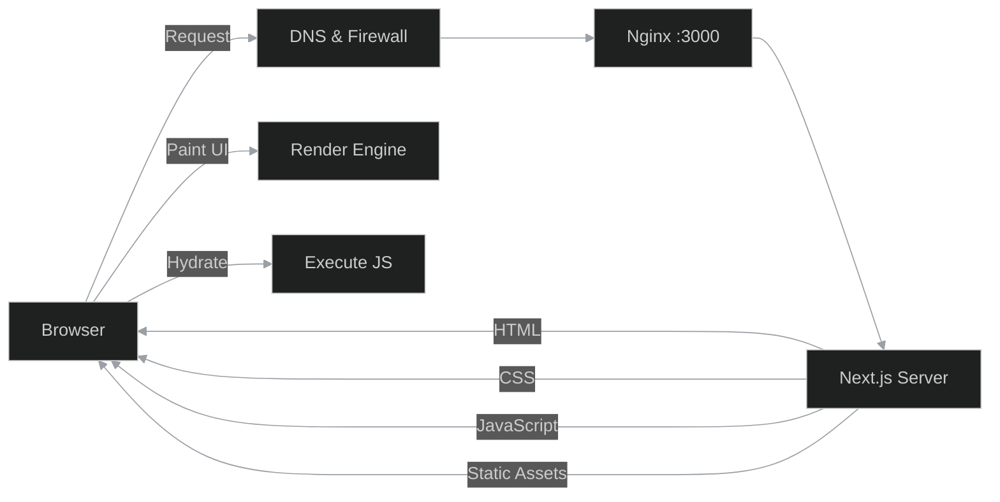

### 4.2. Key Difference: Execution Environment

*   **Backend:** The server receives a request, **processes the logic on the server**, and sends back the *result*.
*   **Frontend:** The server sends the *code* (HTML/JS/CSS) to the client. **The browser (client's machine) runs the code.**


---

## 5. Why Backend Logic Cannot be on the Frontend

There are four specific reasons why backend logic (database connections, heavy processing) cannot be moved to the frontend.

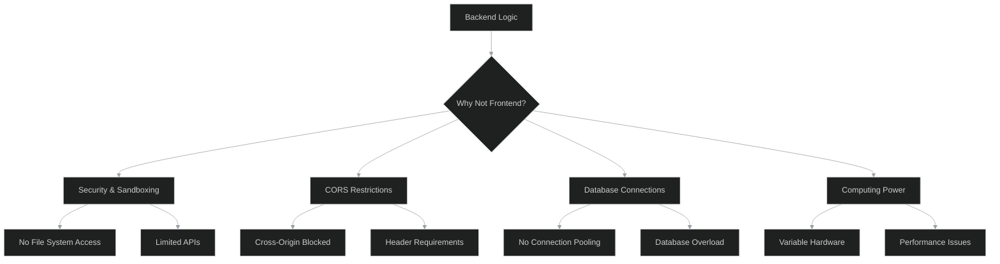

### 5.1. Security and Sandboxing

*   **Sandboxed Environment:** Browsers isolate the execution environment. Code cannot access the user's operating system, processes, or file system.
*   **Limited Access:** Frontend code can only access specific browser APIs (DOM, Local Storage, Cookies).
*   **The Problem:**
    *   Backend servers often need to access the file system (e.g., writing logs, accessing environment variables). Browsers strictly block this.
*   **Rationale:** If browsers did not enforce this isolation, visiting a malicious website could allow remote code to scan your file system, copy sensitive files, and send them to a remote server.

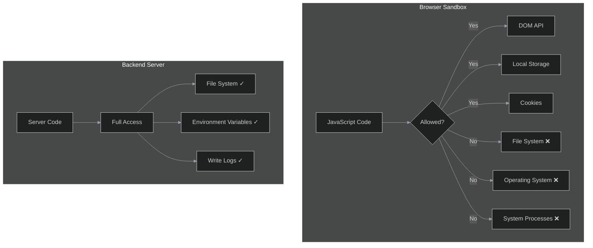

### 5.2. CORS (Cross-Origin Resource Sharing)

*   **Definition:** A browser security policy that restricts JavaScript from calling external APIs that reside on a different domain than the current page.
*   **Restriction:** You can only fetch resources from the same domain unless the external API explicitly allows it via HTTP headers.
*   **The Problem:** Backend servers often need to fetch data from multiple third-party sources. If those sources do not have specific CORS headers configured for your client, the browser will block the request. A backend server does not have this restriction.

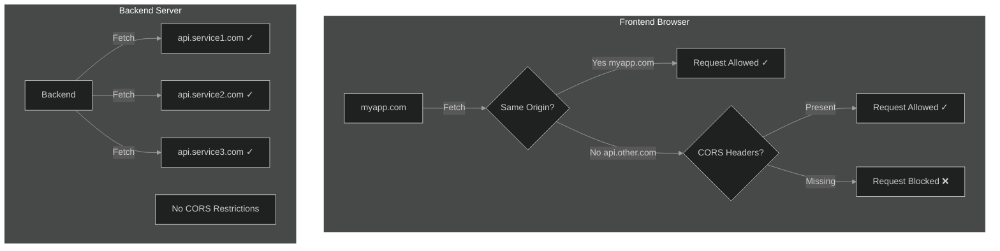

### 5.3. Database Connections

*   **Drivers:** Backend servers use native database drivers (e.g., `pg` for Postgres, MongoDB drivers).
    *   These are designed to handle **socket connections** and **binary data**.
    *   They maintain **persistent connections**.
*   **Connection Pooling:**
    *   Backends maintain a "pool" of open connections to the database.
    *   They reuse these connections for thousands of incoming requests.
    *   Creating and destroying a connection for every single request is expensive and would overwhelm the database.
*   **The Problem:**
    *   Browsers are not designed to maintain persistent connections.
    *   Browsers cannot manage connection pooling.
    *   If logic were on the frontend, every single user would open a unique connection to the database. This would flood the database server with too many connections, causing it to crash.

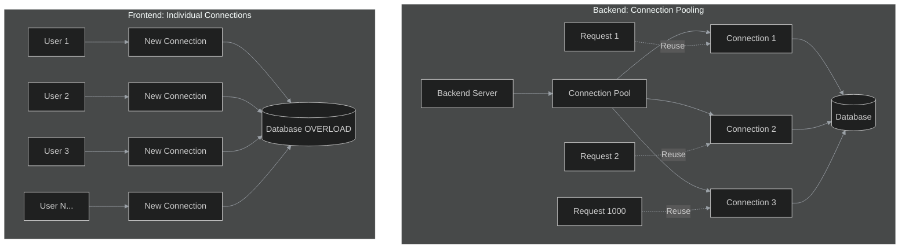

### 5.4. Computing Power

*   **Variability:** Frontend applications run on user devices (smartphones, old laptops, desktops).
    *   Hardware specs vary wildly (e.g., 256MB RAM, single-core processors).
*   **The Problem:**
    *   Heavy business logic requires reliable computing power.
    *   Running heavy logic on a low-end client device causes lag or crashes.
*   **Backend Advantage:** A centralized server is a controlled environment. You can easily scale CPU and Memory resources to handle increased load, ensuring consistent performance regardless of the user's device.

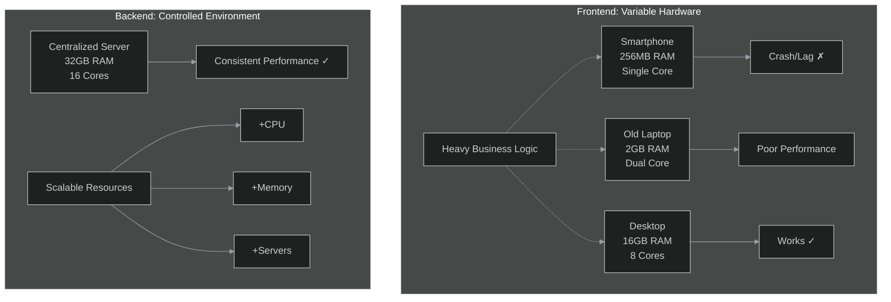

## 6. Complete Introduction to Backend Engineering Roadmap

```mermaid
%%{init: {"theme": "dark", "themeVariables": {"primaryColor": "#2d2d2d", "primaryTextColor": "#e6edf3", "primaryBorderColor": "#444444", "lineColor": "#9aa0a6", "secondaryColor": "#3a3a3a", "tertiaryColor": "#2d2d2d"}}}%%
flowchart TD
    A["Introduction to Backend"] --> B["1. Definition of a Backend"]
    B --> B1["1.1. Traditional Definition"]
    B1 --> C["2. End-to-End Request Flow"]
    C --> C1["2.1. The Browser & Domain Name"]
    C1 --> C2["2.2. DNS Server"]
    C2 --> C3["2.3. Cloud Infrastructure"]
    C3 --> C4["2.4. The Firewall"]
    C4 --> C5["2.5. Reverse Proxy"]
    C5 --> C6["2.6. The Application Server"]
    C6 --> C7["2.7. Summary of the Flow"]
    C7 --> D["3. The Purpose of Backend Systems"]
    D --> D1["3.1. Centralized Data"]
    D1 --> D2["3.2. Like Button Flow"]
    D2 --> D3["3.3. Why Backend Required"]
    D3 --> E["4. Frontend vs Backend Architecture"]
    E --> E1["4.1. Frontend Request Flow"]
    E1 --> E2["4.2. Execution Environment"]
    E2 --> F["5. Why Backend Logic Cannot be on Frontend"]
    F --> F1["5.1. Security and Sandboxing"]
    F1 --> F2["5.2. CORS"]
    F2 --> F3["5.3. Database Connections"]
    F3 --> F4["5.4. Computing Power"]

    classDef mainNode fill:#2d2d2d,stroke:#555555,color:#e6edf3
    classDef subNode fill:#3a3a3a,stroke:#666666,color:#e6edf3
    
    class A mainNode
    class B,C,D,E,F mainNode
    class B1,C1,C2,C3,C4,C5,C6,C7,D1,D2,D3,E1,E2,F1,F2,F3,F4 subNode
```