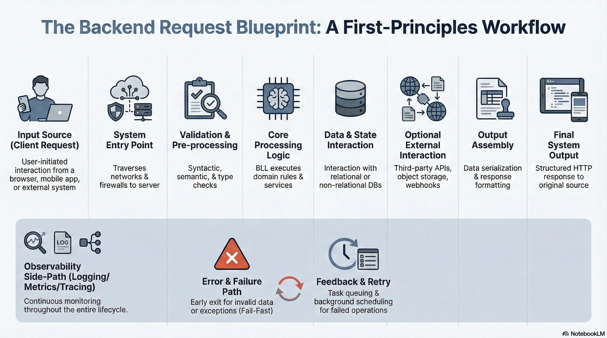
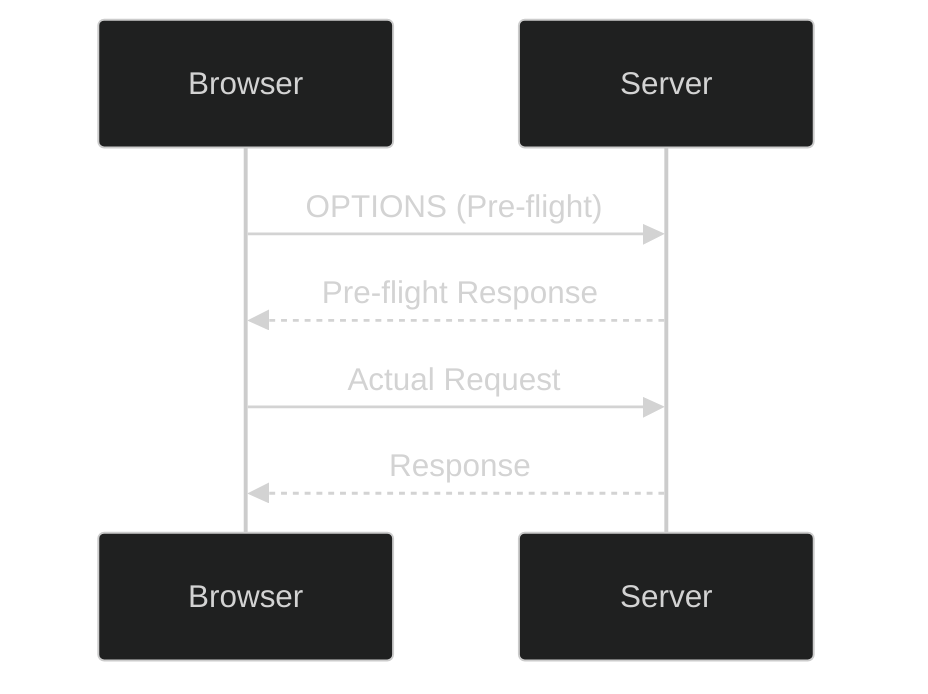
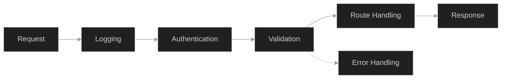

# Overview

  <iframe
    src="https://www.youtube.com/embed/C7F2VoJrqzU?si=1dH85TjXPB6uxSlD"
    title="YouTube video player"
    style="position:absolute;top:0;left:0;width:100%;height:100%;border:0;"
    allow="accelerometer; autoplay; clipboard-write; encrypted-media; gyroscope; picture-in-picture; web-share"
    referrerpolicy="strict-origin-when-cross-origin"
    allowfullscreen>
  </iframe>

## 1. Introduction to Backend Engineering

*   **Definition**: Backend engineering extends beyond building CRUD APIs. It involves building codebases and systems that are:
    *   **Reliable**
    *   **Scalable**
    *   **Fault-tolerant**
    *   **Maintainable**
    *   **Efficient**
*   **Learning Challenges**:
    *   Extremely wide scope.
    *   Difficulty in prioritization and seeing the "big picture."
    *   Concepts often learned in isolation (college, bootcamps) leading to reliance on trial and error.
*   **Pitfalls of Language-First Learning**:
    *   Starting with a specific framework (e.g., Express, Spring Boot, Ruby on Rails) creates "blind spots."
    *   Solutions are viewed through the lens of a specific ecosystem.
    *   **Transferability issues**: Knowledge is hard to transfer if underlying systems are not understood (e.g., migrating from Ruby on Rails to Golang for performance).

## 2. High-Level System Architecture

*   **Request Flow**:
    1.  Request originates from a browser.
    2.  Travels through network hops and firewalls over the internet.
    3.  Routed to a remote server (e.g., AWS).
    4.  Server processes and responds.
*   **Core Understanding**: Visualizing how clients communicate with servers and what the response looks like.

## 3. HTTP Protocol

*   **Communication**: How connection is established.
*   **Raw Messages**: Understanding the structure.
*   **HTTP Headers**:
    *   **Request Headers**
    *   **Representational Headers**
    *   **General Headers**
    *   **Security Headers**
*   **HTTP Methods**:
    *   `GET`, `POST`, `PUT`, `DELETE`
    *   Semantics and principles behind usage.
*   **CORS (Cross-Origin Resource Sharing)**:
    *   Pre-flight requests: Flow from browser to server and back.

*   **HTTP Responses**:
    *   Structure.
    *   **Status Codes**: When to return which code; common codes.
*   **HTTP Caching**:
    *   Techniques: `ETags`, `max-age` headers.
*   **Versions**:
    *   Differences between HTTP/1.1, HTTP/2.0, and HTTP/3.0.
*   **Content Negotiation**: Using headers to determine content format.
*   **Persistent Connections**: How they work.
*   **HTTP Compression**:
    *   Techniques: `gzip`, `deflate`, `br`.
    *   Common usage.
*   **Security**:
    *   SSL/TLS.
    *   HTTPS.

## 4. Routing

*   **Definition**: Mapping URLs to server-side logic.
*   **Components**:
    *   Path parameters.
    *   Query parameters.
*   **Types of Routes**:
    *   Static routes.
    *   Dynamic routes.
    *   Nested routes.
    *   Hierarchical routes.
    *   Catch-all / Wildcard routes.
    *   Regular expression-based routes.
*   **API Versioning**:
    *   Techniques using HTTP.
    *   Best practices for deprecating routes.
*   **Route Grouping**:
    *   Benefits for versioning.
    *   Permissions.
    *   Shared middleware.
*   **Optimization**: Secure routes and route matching performance.

## 5. Serialization and Deserialization

*   **Definitions**:
    *   **Serialization**: Translating native data to a network format before sending.
    *   **Deserialization**: Translating received network data back to native format.
    *   Role in **interoperability standards**.
*   **Formats**:
    *   **Text-based**: JSON, XML (Trade-off: Readability vs Performance).
    *   **Binary**: Protobuf (Faster performance).
*   **JSON Deep Dive**:
    *   Structure and Data Types: Strings, numbers, booleans, arrays, objects.
    *   Handling nested objects and collections.
    *   **Deserialization to Native Structures**:
        *   Python dictionaries.
        *   Golang structs.
        *   JavaScript objects.
    *   **Common Errors**:
        *   Missing or extra fields.
        *   Null values.
        *   Date serialization and time zone issues.
    *   Custom serialization implementation.
*   **Error Handling**:
    *   Invalid data.
    *   Data conversion errors.
    *   Unknown fields.
*   **Security Concerns**:
    *   Injection attacks.
    *   Validation before deserialization.
    *   **JSON Schema validation**.
*   **Performance**:
    *   Reducing serialized data size (compression, eliminating unnecessary fields).
    *   Trade-offs between readability (text) and speed (binary).

## 6. Authentication and Authorization

*   **Concepts**: Why they are used.
*   **Types of Authentication**:
    *   Stateful vs. Stateless.
    *   Basic Authentication.
    *   Bearer Token Authentication.
*   **Components**:
    *   Sessions.
    *   JWTs (JSON Web Tokens).
    *   Cookies.
*   **Protocols**:
    *   OAuth.
    *   OpenID Connect.
*   **Mechanisms**:
    *   API Keys.
    *   Multi-factor Authentication (MFA).
    *   Salting and Hashing.
    *   Cryptographic techniques.
*   **Access Control Models**:
    *   ABAC (Attribute-Based Access Control).
    *   RBAC (Role-Based Access Control).
    *   ReBAC (Relationship-Based Access Control).
*   **Security Best Practices**:
    *   Securing cookies.
    *   Avoiding CSRF, XSS, MITM (Man-in-the-Middle).
    *   **Audit Logging**: Recording events for audits, monitoring failed logins, privilege escalation, and access to sensitive resources.
    *   **Obfuscation**: Preventing information leakage through detailed error messages.
    *   **Consistency**: Handling failure modes (rate limiting, account lockout) consistently.
    *   **Timing Attacks**: Preventing attackers from inferring credentials based on response time differences (e.g., password hashing time vs. username lookup time).

## 7. Validation and Transformation

*   **Types of Validation**:
    *   **Syntactic**: Format checks (Email, valid phone number, date format).
    *   **Semantic**: Logical checks (Date of birth not in future, age between 1-120).
    *   **Type**: Input matches expected type (String, Integer, Array, Object).
    *   **Relationship**: Comparing fields (Password vs. Confirm Password).
    *   **Conditional**: Requirements based on other fields (Partner name required if `married=true`).
    *   **Chain**: Sequential checks (Lower casing -> Remove special chars -> Check length).

*   **Client vs. Server Side**:
    *   **Client**: Improves UX (instant feedback).
    *   **Server**: True security gateway (essential for business logic protection).
*   **Principles**:
    *   **Fail Fast**: Reduce unnecessary processing by returning early.
    *   Consistency between front-end and back-end logic.
*   **Transformation**:
    *   **Type Casting**: Converting strings (from query/path params) to numbers/IDs.
    *   **Date Formats**: Standardizing timestamps.
*   **Normalization**:
    *   Lowercasing emails.
    *   Trimming whitespace.
    *   Adding country codes.
*   **Sanitization**: Preventing security issues like SQL injection.
*   **Error Handling**:
    *   Meaningful messages for users.
    *   Aggregating errors (single response for client display).
    *   **Obfuscation**: Using "Invalid credentials" instead of "Invalid password".
    *   Handling failed transformations (Invalid JSON, failed date conversion).
*   **Performance**: Optimize by returning early and avoiding redundant validations.

## 8. Middleware

*   **Definition**: Code executing in the request cycle.
*   **Role**: Pre-request processing or Post-response processing.
*   **Flow**:
    *   **Chaining**: Executed in sequence.
    *   **Control**: Passing to `next` function or exiting early.
    *   **Short-circuiting**: Handling errors (e.g., 404) immediately.

*   **Ordering Importance**:
    1.  Logging.
    2.  Authentication.
    3.  Validation.
    4.  Route Handling.
    5.  Error Handling.
    *   Incorrect order affects performance and security.
*   **Common Middlewares**:
    *   **Security**: Adding headers (`X-Content-Type`, `HSTS`, `Content Security Policy`), CORS headers.
    *   **Protection**: CSRF avoidance, Rate limiting.
    *   **Authentication**: Reusable route protection logic.
    *   **Observability**: Request logging, structured logging.
    *   **Error Handling**: Catching and formatting application-level errors.
    *   **Compression**: Reducing response body size.
    *   **Data Parsing**: Handling JSON, URL-encoded forms, file uploads (multipart).
*   **Scalability**: Keep lightweight and efficient.

## 9. Request Context

*   **Definition**: Metadata and request-scoped state passed through layers (middleware, controllers, services).
*   **Lifecycle**: Valid only for the duration of the request.
*   **Purpose**: Sharing data without coupling.
*   **Components**:
    *   **Metadata**: HTTP method, URL, headers, query params, body.
    *   **User Info**: Session/User details injected by Auth middleware.
    *   **Tracking**: Unique Request IDs, Trace IDs.
    *   **Custom Data**: Caching data, permission checks.
*   **Use Cases**: Authentication, Rate limiting, Tracing, Logging.
*   **Timeouts**:
    *   Request timeouts.
    *   Custom timeouts.
    *   Cancellation signals.
*   **Best Practices**:
    *   Keep lightweight (prevent memory overhead).
    *   Clean up after request lifecycle (prevent memory leaks).
    *   Avoid tight coupling or over-reliance.

## 10. Handlers and Controllers

*   **Architecture**: MVC Pattern (Handlers, Controllers, Services).
*   **Responsibilities**:
    *   Centralized error handling.
    *   Consistent success/error message formats.
*   **CRUD Operations**:
    *   **POST**: Creation/Submission (Status: `201 Created` or `400 Bad Request`).
    *   **GET**: Fetching lists or single resources.
    *   **PUT/PATCH**: Updating resources.
    *   **DELETE**: Deleting resources.
*   **Implementation Details**:
    *   Pagination.
    *   Search APIs.
    *   Sorting and Filtering.
*   **Best Practices**:
    *   Strict validation.
    *   Consistent response formatting.
    *   Limiting payload.
    *   Redacting sensitive fields.

## 11. RESTful Architecture

*   **Principles**: Designing APIs around resources and HTTP semantics.
*   **Versioning Types**:
    *   URI versioning.
    *   Header versioning.
    *   Query string versioning.
    *   Media type versioning.
*   **Design Considerations**:
    *   OpenAPI specification.
    *   Content Negotiation.
    *   Capturing exceptions with meaningful messages.
    *   **Caching**: Client-side support (ETags).
    *   Optimizing large requests/responses.

## 12. Databases

*   **Types**: Relational vs. Non-relational (Differences and use cases).
*   **Theoretical Concepts**:
    *   ACID properties.
    *   CAP theorem.
*   **Operations**:
    *   Basic querying and joins.
    *   **Design**: Schema design, Indexing.
*   **Optimization**:
    *   Query optimization.
    *   Caching.
    *   Connection pooling.
*   **Data Integrity**:
    *   Constraints and validations.
    *   Transactions and concurrency.
*   **Tooling**:
    *   **ORMs**: Trade-offs.
    *   **Migrations**: Managing schema changes.

## 13. Business Logic Layer (BLL)

*   **Role**: The core layer between Presentation (handlers/routes) and Data Access (database).
*   **Design Principles**:
    *   Separation of concerns.
    *   Single Responsibility.
    *   Open-Closed Principle.
    *   Dependency Inversion.
*   **Components**:
    *   Services.
    *   Domain Models (Core entities like User, Order).
    *   Business Tools.
    *   Business Validation Logic.
*   **Best Practices**:
    *   Service layer design.
    *   Proper error handling and propagation to presentation layer.

## 14. Caching

*   **Purpose**: Difference from database persistence.
*   **Types**:
    *   Memory caching.
    *   Browser caching.
    *   Database caching.
    *   Client-side vs. Server-side.
*   **Strategies**:
    *   Cache aside.
    *   Write-through.
    *   Write-behind (Write-back).
    *   Read-through.
*   **Eviction Strategies**:
    *   LRU (Least Recently Used).
    *   LFU (Least Frequently Used).
    *   TTL (Time To Live).
    *   FIFO (First In First Out).
*   **Invalidation**:
    *   Manual.
    *   Time To Live (TTL).
    *   Event-based.
*   **Levels**:
    *   **Level 1**: In-memory (Fast, Small).
    *   **Level 2**: Network distributed (Slower, Large).
    *   **Hierarchical**: Combining L1 and L2.
*   **Implementations**:
    *   Web Apps: Static assets, API responses (headers).
    *   Databases: Query caching (e.g., storing heavy join results in Redis).
    *   Metrics: Optimizing Cache Hit vs. Cache Miss ratio.

## 15. Transactional Emails

*   **Use Cases**: Common scenarios.
*   **Anatomy**:
    *   Subject, Pre-header, Body header, Main content, CTA (Call to Action), Footer.
*   **Personalization**: Dynamic parameters.

## 16. Task Queuing and Scheduling

*   **Task Queuing Use Cases**:
    *   Sending emails.
    *   Processing image files.
    *   Third-party API integrations (Payment processing, Webhooks).
    *   Offloading heavy computation (Batch processing, e.g., "Clear all data" requests).
*   **Scheduling Use Cases**:
    *   Database backups.
    *   Recurring notifications/reminders.
    *   Data synchronization.
    *   Maintenance (Clearing logs/caches).
*   **Components**:
    *   Producer, Queue, Consumer, Broker, Backend.

*   **Flow & Features**:
    *   **Dependencies**: Chain dependency, Parent-Child relationships.
    *   **Task Groups**: Concurrent execution (waiting for all to complete).
    *   **Reliability**: Error handling, Retries.
    *   **Control**: Task prioritization (Payment > Notification), Rate limiting.

## 17. ElasticSearch

*   **Mechanisms**:
    *   Inverted index.
    *   Term frequency & Inverse document frequency.
    *   Segments and Shards.
*   **Use Cases**:
    *   Type-ahead experience.
    *   Log analytics.
    *   Social media search (User profiles, posts, comments).
*   **Management**:
    *   Creating/Managing indexes.
    *   Defining field mappings explicitly.
*   **Searching**:
    *   Basic vs. Full-text search.
    *   Relevance scoring.
    *   Optimization: Text vs. Keyword fields, Analyzers, Boosting, Pagination.
    *   Advanced Patterns: Filtering, Aggregation, Fuzzy search.
*   **Tooling**: Kibana (User-friendly interface).
*   **Best Practices**:
    *   Optimizing shard numbers.
    *   Indexing in batches.
    *   Avoiding wildcards.

## 18. Error Handling

*   **Types of Errors**: Syntax, Runtime, Logical.
*   **Strategies**:
    *   Fail-safe vs. Fail-fast.
    *   Graceful degradation.
    *   Prevention.
*   **Practices**:
    *   Catching early (don't swallow errors).
    *   Custom error types.
    *   Failing gracefully.
    *   Logging with stack traces.
    *   Global error handlers.
*   **User-Facing**: Friendly messages, Actionable feedback.
*   **Monitoring**:
    *   Tools: Sentry, ELK stack.
    *   Alerts: Email, Slack.

## 19. Config Management

*   **Definition**: Decoupling environment-specific settings from logic.
*   **Use Cases**:
    *   Different environments.
    *   Managing sensitive data (API keys, DB passwords, Certificates).
    *   Feature flags (Dynamic enabling/disabling).
*   **Types of Configs**:
    *   **Static**: DB credentials, Endpoints.
    *   **Dynamic**: Feature flags, Rate limits.
    *   **Sensitive**: Credentials, Tokens, Secrets.
*   **Sources**: `.env` files, JSON, YAML.
*   **Comparison**: Environment variables vs. Command line flags vs. Static files.

## 20. Logging, Monitoring, and Observability

*   **Logging**:
    *   Types: System, Application, Access, Security.
    *   Levels: `Debug`, `Info`, `Warn`, `Error`, `Fatal`.
    *   Format: **Structured** vs. Unstructured.
    *   Best Practices: Centralized logging, Rotation/Retention, Contextual logs, Avoiding sensitive data.
*   **Monitoring**:
    *   Types: Infrastructure, Application Performance (APM), Uptime.
    *   Tools: Prometheus, Grafana.
    *   Alerts: Defining thresholds, Avoiding "alert fatigue" (ensure alerts are actionable/meaningful).
*   **Observability**:
    *   **Three Pillars**: Logs, Metrics, Traces.
    *   Security and compliance of log management.

## 21. Graceful Shutdown

*   **Need**: Server restarts, Cloud scaling, Microservices, Long-running jobs.
*   **Mechanism**:
    *   Signal handling: `SIGTERM`, `SIGINT`, `SIGKILL`.
*   **Steps**:
    1.  Capture signal.
    2.  Stop accepting new requests.
    3.  Complete in-flight requests.
    4.  Close external resources (DB connections, open files).
    5.  Terminate app.

## 22. Security

*   **Attack Prevention**:
    *   SQL Injection, NoSQL Injection.
    *   XSS (Cross-Site Scripting).
    *   CSRF (Cross-Site Request Forgery).
    *   Broken Authentication.
    *   Insecure Deserialization.
*   **Design Principles**:
    *   Least privilege.
    *   Defense in depth.
    *   Fail secure.
    *   Defaults.
    *   Separation of duties.
    *   Security by design.
*   **Mechanisms**:
    *   Input validation and sanitization.
    *   Rate limits.
    *   Content Security Policy (CSP).
    *   CORS.
    *   SameSite cookies.
    *   Monitoring events.

## 23. Scaling and Performance

*   **Metrics**: Response time, Resource utilization.
*   **Bottlenecks**: Identifying issues.
*   **Database Optimization**:
    *   Avoiding **N+1 query problems**.
    *   Proper use of Joins.
    *   Lazy loading.
    *   Indexes: Foreign keys, Search fields.
    *   Batch processing for large datasets.
*   **Resource Management**:
    *   Avoid memory leaks (closing handles/connections).
    *   Minimize network overhead (payload size, compression).
*   **Testing**: Performance testing and profiling.
*   **Best Practices**:
    *   Write clear/maintainable code first (avoid premature optimization).
    *   Modular code for individual optimization.
    *   **Graceful Degradation**: System survives if resources are unavailable.
    *   **Offloading**: Move non-critical tasks (Email, Logging) to background queues.

## 24. Concurrency and Parallelism

*   **Differences**:
    *   **Concurrency**: Helps in I/O bound tasks.
    *   **Parallelism**: Helps in CPU bound tasks.

## 25. Object Storage and Large Files

*   **Object Storage**: AWS S3 usage.
*   **Large File Management**:
    *   Chunking.
    *   Streaming.
    *   Multipart file uploads.

## 26. Real-time Backend Systems

*   **Technologies**:
    *   WebSockets.
    *   Server-Sent Events (SSE).
*   **Architecture**: Pub/Sub.

## 27. Testing and Code Quality

*   **Types of Testing**:
    *   Unit, Integration, End-to-End (E2E).
    *   Functional, Regression.
    *   Performance, Load, Stress.
    *   User Acceptance Testing (UAT).
    *   Security testing.
*   **Methodologies**: Test Driven Development (TDD).
*   **Automation**: Tests in CI/CD environments.
*   **Code Quality**:
    *   Linting and Formatting tools.
    *   **Cyclomatic Complexity**: Measures complexity by counting possible paths.
    *   **Maintainability Index**: Quantifies ease of maintenance based on complexity/lines of code.

## 28. 12 Factor App

*   Set of principles for building software-as-a-service apps.

## 29. OpenAPI Standards

*   **Benefits**:
    *   Standardization.
    *   Documentation Automation.
    *   Ecosystem: Swagger, Codegen, Postman.
*   **History**: Swagger to OpenAPI transition.
*   **Key Concepts (Document Structure)**:
    *   API Paths.
    *   Request/Response definitions.
    *   Parameters and Schemas.
    *   Metadata, Components, Security definitions.
*   **Versions**: Features of 3.0 and 3.1.
*   **Tools**: Swagger UI, Codegen, Postman.
*   **API First Development**: Defining spec first, then creating APIs.

## 30. Webhooks

*   **Use Cases**: Notifications, Third-party integrations.
*   **Comparison**:
    *   **API**: Polling (Client-initiated).
    *   **Webhooks**: Pushing (Server-initiated).
*   **Components**:
    *   Webhook URL.
    *   Event triggers.
    *   Payload.
    *   HTTP Method.
    *   Response handling.
*   **Best Practices**:
    *   Signature verification.
    *   Using HTTPS.
    *   Quick response.
    *   Retry logic.
    *   Logging.
    *   Testing with tools like Ngrok.
*   **Examples**: Stripe Payment Processing, GitHub, Slack, Discord, Twilio.

## 31. DevOps Concepts

*   **Core Concepts**:
    *   Continuous Integration (CI).
    *   Continuous Delivery (CD).
    *   Continuous Deployment.
*   **Practices**:
    *   Infrastructure as Code (IaC).
    *   Config Management.
    *   Version Control.
*   **Tools**:
    *   Containers: Docker.
    *   Orchestration: Kubernetes.
    *   CI/CD Pipelines.
*   **Scaling**: Horizontal vs. Vertical.
*   **Deployment Strategies**:
    *   Red-Green Deployment.
    *   Rolling Deployment.

## Final Learning Outcomes
-   Requirements for success:
    -   Decide to take the journey.
    -   Internalize everything.
    -   Follow along with all projects.
-   **Resulting Capabilities**:
    -   Safely call yourself a **Backend Engineer**.
    -   Build **real systems**.
    -   Build systems that **scale** (from zero users to a million users).
    -   Build systems that are **maintainable** over a long period of time.

## Complete Overview Roadmap

```mermaid
%%{init: {"theme": "dark"}}%%
flowchart TD
    A["Overview"] --> B["1. Introduction to Backend Engineering"]
    B --> C["2. High-Level System Architecture"]
    C --> D["3. HTTP Protocol"]
    D --> E["4. Routing"]
    E --> F["5. Serialization and Deserialization"]
    F --> G["6. Authentication and Authorization"]
    G --> H["7. Validation and Transformation"]
    H --> I["8. Middleware"]
    I --> J["9. Request Context"]
    J --> K["10. Handlers and Controllers"]
    K --> L["11. RESTful Architecture"]
    L --> M["12. Databases"]
    M --> N["13. Business Logic Layer (BLL)"]
    N --> O["14. Caching"]
    O --> P["15. Transactional Emails"]
    P --> Q["16. Task Queuing and Scheduling"]
    Q --> R["17. ElasticSearch"]
    R --> S["18. Error Handling"]
    S --> T["19. Config Management"]
    T --> U["20. Logging, Monitoring, and Observability"]
    U --> V["21. Graceful Shutdown"]
    V --> W["22. Security"]
    W --> X["23. Scaling and Performance"]
    X --> Y["24. Concurrency and Parallelism"]
    Y --> Z["25. Object Storage and Large Files"]
    Z --> AA["26. Real-time Backend Systems"]
    AA --> AB["27. Testing and Code Quality"]
    AB --> AC["28. 12 Factor App"]
    AC --> AD["29. OpenAPI Standards"]
    AD --> AE["30. Webhooks"]
    AE --> AF["31. DevOps Concepts"]

    classDef level1 fill:#2d2d2d,stroke:#444444,color:#ffffff
    classDef level2 fill:#3a3a3a,stroke:#555555,color:#ffffff

    class A level1
    class B,C,D,E,F,G,H,I,J,K,L,M,N,O,P,Q,R,S,T,U,V,W,X,Y,Z,AA,AB,AC,AD,AE,AF level2
```

